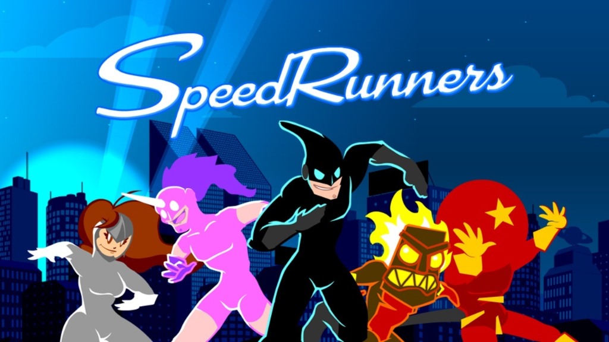
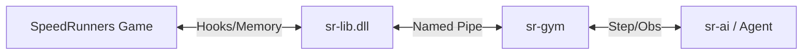

# SpeedRunners RL



This repository serves as the central hub for the SpeedRunners Reinforcement
Learning project. It aggregates the necessary components to train and evaluate
AI agents in the game SpeedRunners.

## Overview

The project is divided into three main components, included here as submodules:

- **[sr-lib](sr-lib)**: A C++ library that builds into a DLL. It handles the
  low-level communication with the SpeedRunners game process, exposing hooks to
  read game state and inject actions.
- **[sr-gym](sr-gym)**: A Python library that implements the
  [Gymnasium](https://gymnasium.farama.org/) interface. It communicates with
  `sr-lib` via named pipes to provide a standard RL environment.
- **[sr-ai](sr-ai)**: A Python library containing Deep Reinforcement Learning
  agents (e.g., Rainbow IQN, RND) and training scripts designed to work with
  `sr-gym`.

## Installation

### 1. Clone the repository

Clone this repository and initialize the submodules:

```bash
git clone --recursive <this-repo-url>
cd speedrunners-rl
# If you cloned without --recursive:
git submodule update --init --recursive
```

### 2. Build sr-lib

`sr-lib` must be built and injected into the game to function.

1. Navigate to `sr-lib`.
2. Build the project using CMake or your preferred C++ build tool (Visual
   Studio, etc.). Ensure you include the `include` and `lib` directories.
3. This will produce a DLL file (e.g., `sr-lib.dll`).

### 3. Install Python Packages

Install the Python dependencies for the gym environment and AI agents. It is
recommended to use a virtual environment.

```bash
# Install sr-gym
pip install -e ./sr-gym

# Install sr-ai
pip install -e ./sr-ai
```

## Usage

### 1. Launch SpeedRunners

1. Open SpeedRunners on Steam.
2. Enter a "Free Practice" map or a custom lobby (depending on your training
   needs).

### 2. Inject sr-lib

Use your preferred DLL injector to inject the built `sr-lib.dll` into the
`SpeedRunners.exe` process.

- Open the in-game console (usually `~`) to verify injection.
- Wait for the message: `"Waiting for client..."`.

### 3. Run Training / Inference

You can now run experiments using `sr-ai`. The primary entry point for training
is `sr_ai/experiments/iqn.py`.

Example command to train an agent:

```bash
python sr-ai/sr_ai/experiments/iqn.py --experiment_path ./experiments/test_run --render
```

**Common Arguments:**

- `--experiment_path`: Directory to save logs and models.
- `--render`: Render the gym environment (though the game window is always
  visible).
- `--play`: Run in inference mode using a trained model.
- `--load_path`: Path to a saved model checkpoint.
- `--device`: `cuda` or `cpu`.

See `sr-ai/sr_ai/experiments/iqn.py` for a full list of arguments, including
hyperparameters for IQN, RND, and LSTM.

## Architecture


